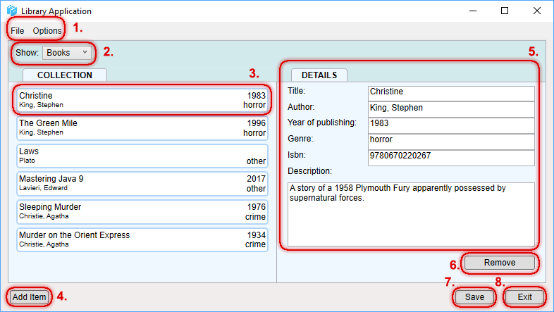

# TTOS0300-harjoitustyö

* Arttu Rousku / @M1484 
* Markéta Sovová / @M1482
* 2019 
* Versionumero 0.1

## Sisällysluettelo

* [Johdanto](#johdanto)
* [Asennus](#asennus)
* [Tietoa ohjelmasta](#tietoa-ohjelmasta)
* [Ruutukaappaukset ohjelmaikkunoista](#ruutukaappaukset-ohjelmaikkunoista)

# Johdanto

Tämä sovellus on käyttöliittymien ohjelmointi -kurssia varten toteutettu harjoitustyö. 
Toteutimme työnämme kirjastosovelluksen, jonka tietokantaa on mahdollista muokata lisäämällä, päivittämällä sekä poistamalla tietoja sovelluksen eri toiminnoilla.
Kurssinvetäjänä toimi Esa Salmikangas ja harjoitustyön ovat tehneet Arttu Rousku ja Markéta Sovová.

# Asennus

Tarkoituksenamme oli tehdä mahdollisimman siirrettävissä oleva sovellus, joten ohjelma ei vaadi kuin Windows-käyttöjärjestelmän.

## Asennusohjeet

Pura lataamasi zip-paketti mihin tahansa kansioon ja avaa .exe -päätteinen tiedosto.

# Tietoa ohjelmasta

## Toteutetut toiminnalliset vaatimukset

| VaatimusID | Tyyppi | Kuvaus |								
|:-:|:-:|:-:|
| FUNCTION-REQ-0001 | Functional Requirement | Ohjelmassa on voitava lisätä, muokata ja poistaa tietokannan kirja |
| FUNCTION-REQ-0002 | Functional Requirement | Ohjelmassa on voitava lisätä, muokata ja poistaa tietokannan kirjailija |
| FUNCTION-REQ-0003 | Functional Requirement | Ohjelmassa on voitava lisätä, muokata ja poistaa tietokannan genre  |
| FUNCTION-REQ-0004 | Functional Requirement | Ohjelmassa on kyettävä selaamaan kirja-, kirjailija-, ja genrelistoja |

## Ei-toteutetut toiminnalliset vaatimukset

| VaatimusID | Tyyppi | Kuvaus |								
|:-:|:-:|:-:|
| FUNCTION-REQ-0005 | Functional Requirement | Ohjelmassa on voitava hakea kirja-, kirjailija- tai genretietue hakusanalla ||

## Ei-toiminnalliset vaatimukset ja reunaehdot

| VaatimusID | Tyyppi | Kuvaus |								
|:-:|:-:|:-:|
| NONFUNCTION-REQ-0001 | Non-Functional Requirement | Ohjelmaa on voitava käyttää ilman ylimääräistä asentamista |					
| NONFUNCTION-REQ-0002 | Non-Functional Requirement | Ohjelman on tarkistettava lomakkeista relaatioiden kannalta tärkeimpien tietojen olemassaolo ja validiteetti ennen tallentamista tietokantaan |
| NONFUNCTION-REQ-0003 | Non-Functional Requirement | Ohjelman on tarkistettava genren olemassaolo duplikaattien estämiseksi |
| NONFUNCTION-REQ-0004 | Non-Functional Requirement | Ohjelman on tarkistettava relaatioiden puuttuminen ennen kirjailijan / genren poistamista |
| NONFUNCTION-REQ-0005 | Non-Functional Requirement | Tietokannan on oltava lokaali |
| SECURITY-REQ-0001 | Non-Functional Security | SQL-injektointi on estettävä |
| SECURITY-REQ-0002 | Non-Functional Security | Ohjelmassa on käytettävä turvallisia SQL-komentoja |

# Ruutukaappaukset ohjelmaikkunoista

## Pääikkuna

### Selitykset

1. Valikko
2. Halutun kokoelman listaus
3. Tietue
4. Painike lisäysikkunaan
5. Tietueen sisältämän tiedon tarkastelu ja muokkaus
6. Tietueen poistopainike
7. Tietokannan tallennuspainike
8. Ohjelman sulkemispainike

## Lisäysikkuna

### Selitykset

1. Halutun tietuetyypin valinta
2. Uuden tietueen tietojen täyttö
3. Tietueen tallennus
4. Lisäyksen peruutus ja ikkunan sulkeminen

# Ohjelman mukana tuleva tietokanta